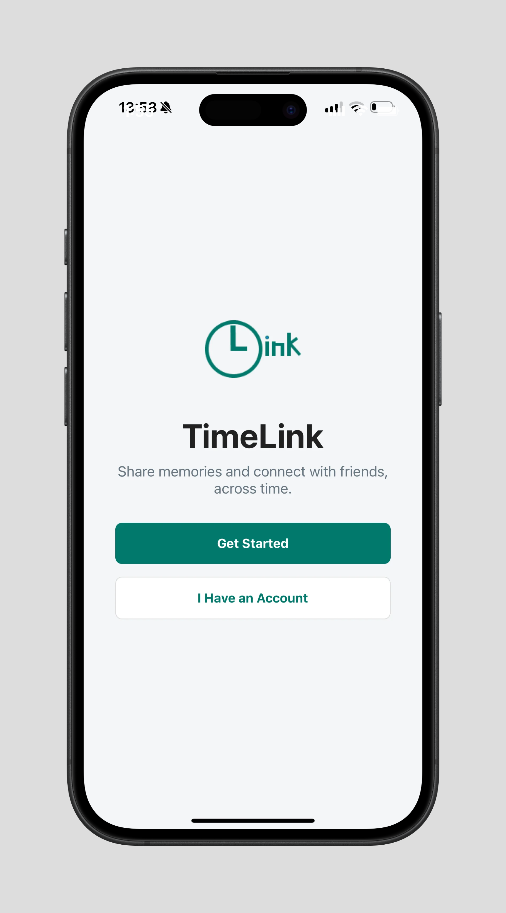
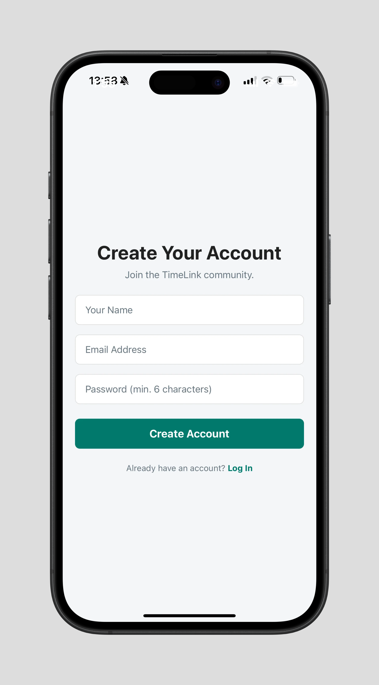
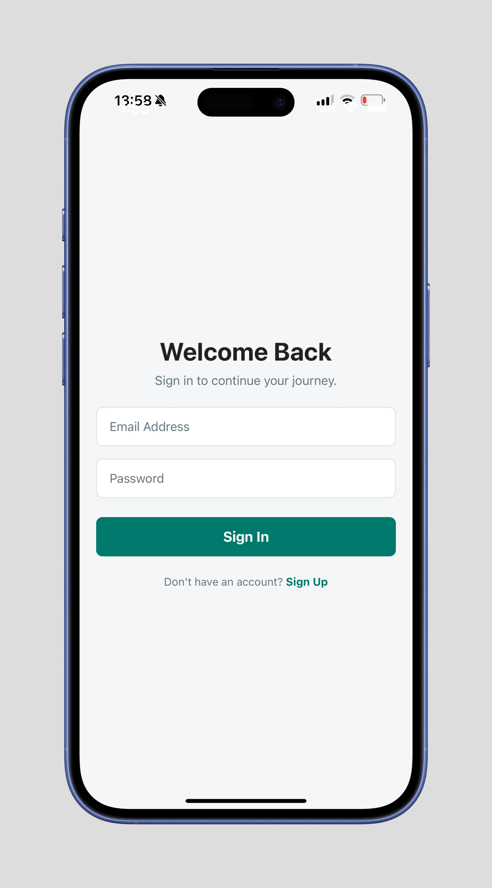
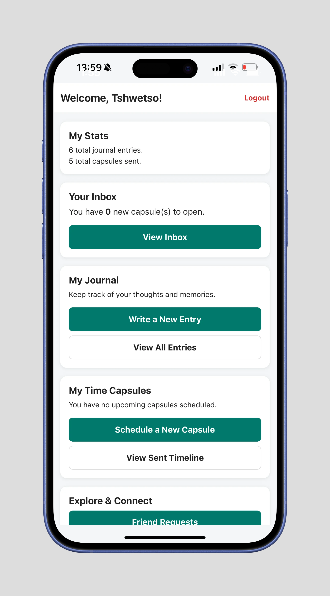
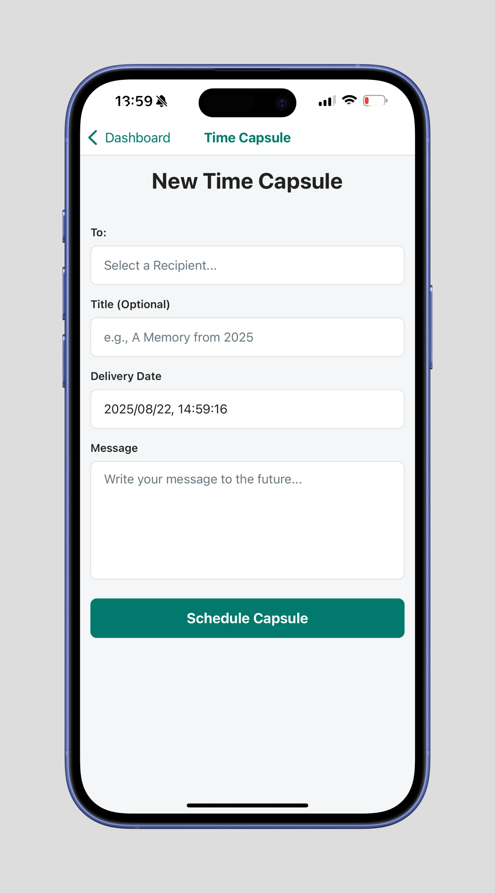
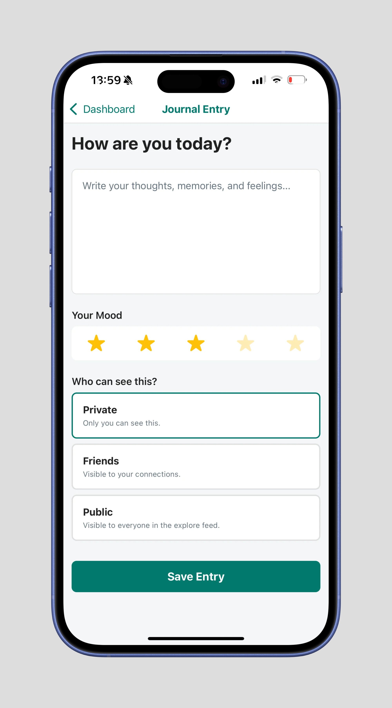
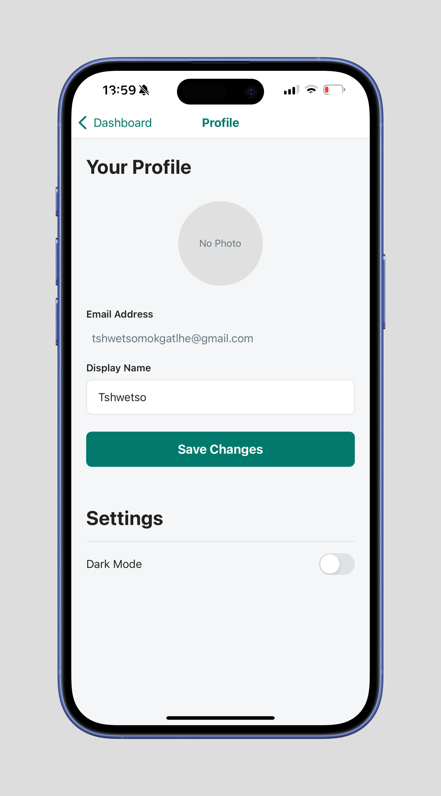
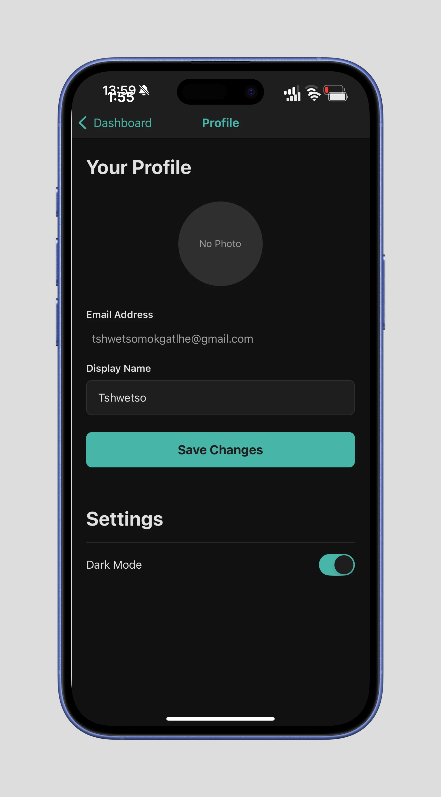
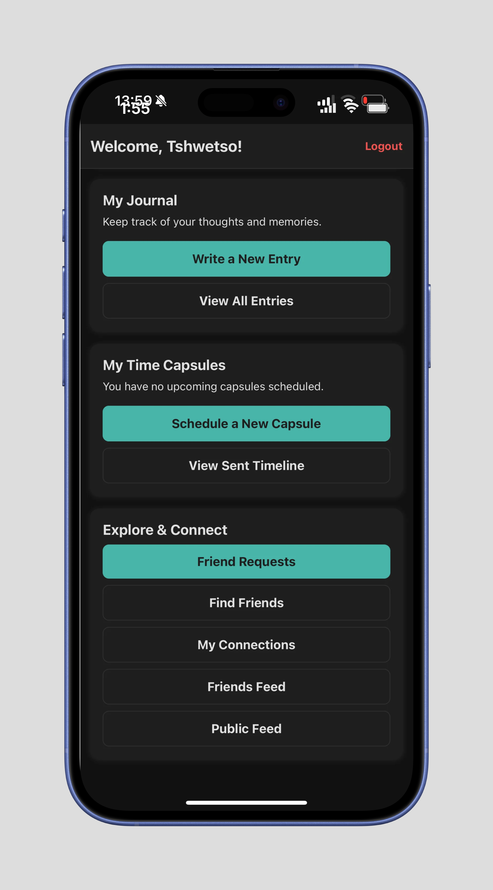

<!-- REPLACE ALL THE [USERNAME] TEXT WITH YOUR GITHUB PROFILE NAME & THE [PROJECTNAME] WITH THE NAME OF YOUR GITHUB PROJECT -->

<!-- Repository Information & Links-->
<br />


<!-- HEADER SECTION -->
<h5 align="center" style="padding:0;margin:0;">Tshwetso K. Mokgatlhe</h5>
<h5 align="center" style="padding:0;margin:0;">Student Number: 221411</h5>
<h6 align="center">DV300 | Interaction Development | 2025</h6>
</br>
<p align="center">

  <a href="https://github.com/TshwetsoMo/TimeLinked">
    
  </a>
  
  <h3 align="center">TimeLink</h3>

  <p align="center">
    Stay connected, across time and memory. A cross-platform journaling & time capsule app.<br>
      <a href="https://github.com/TshwetsoMo/TimeLinked"><strong>Explore the docs »</strong></a>
   <br />
   <br />
   <a href="https://drive.google.com/file/d/1XFYxnq2RMVfamPVBhObwc-1NxEM8piwt/view?usp=drive_link">View Demo</a>
    ·
    <a href="https://github.com/TshwetsoMo/TimeLinked/issues">Report Bug</a>
    ·
    <a href="https://github.com/TshwetsoMo/TimeLinked/issues">Request Feature</a>
</p>

---

## Table of Contents

- [About the Project](#about-the-project)
  - [Project Description](#project-description)
  - [Built With](#built-with)
- [Getting Started](#getting-started)
  - [Prerequisites](#prerequisites)
  - [How to Install](#how-to-install)
- [Features and Functionality](#features-and-functionality)
- [Concept Process](#concept-process)
- [Development Process](#development-process)
- [Final Outcome](#final-outcome)
- [Roadmap](#roadmap)
- [Contributing](#contributing)
- [License](#license)
- [Contact](#contact)
- [Acknowledgements](#acknowledgements)

---

## 🧠 About the Project

![image1][image1]

### Project Description

**TimeLink** is a cross-platform (iOS & Android) React Native app built with **Expo** and **TypeScript**.  
It helps users preserve connections across time through **Daily Journals** and **Scheduled Time Capsules**—messages that resurface at meaningful future moments.  
The UI has **landscape affinity**, and the backend uses **Firebase** for authentication, storage, and real-time data.

### Built With

- [Expo SDK 54](https://expo.dev)
- [React Native 0.81](https://reactnative.dev/)
- [TypeScript 5](https://www.typescriptlang.org/)
- [Firebase Auth & Firestore](https://firebase.google.com/)
- [Reanimated 4 + Moti](https://docs.expo.dev/versions/latest/sdk/reanimated/)
- [React Navigation v7](https://reactnavigation.org/)
- [Expo Image Picker](https://docs.expo.dev/versions/latest/sdk/imagepicker/)

---

## 🚀 Getting Started

### Prerequisites

- Node.js LTS (≥ 18)
- Expo Go app (Android/iOS)
- A configured Firebase project with **Auth**, **Firestore**, and **Storage**

### How to Install

```bash
# Clone repository
git clone https://github.com/TshwetsoMo/TimeLinked.git
cd TimeLinked
```

# Install dependencies

```
npm install
```

# Start Expo server (tunnel recommended)

```
npx expo start --tunnel
```

---

## 📱 Expo Go Tips

- If QR scan does not load the app:

  - Use tunnel mode.
  - Ensure phone and computer are on the same Wi-Fi if using LAN.
  - Disable VPN or firewall, or keep using `--tunnel`.

- Android USB development:

  ```bash
  npx expo start --localhost
  adb reverse tcp:8081 tcp:8081
  ```

---

## 🎨 Mockups

<p align="center">
  
  
  
  
  
  
  
  
  
</p>

## 👨‍💻 Developer Contact

- **Name:** Tshwetso K. Mokgatlhe
- **Email:** [tshwetsomokgatlhe98@gmail.com](mailto:tshwetsomokgatlhe98@gmail.com)
- **Portfolio:** [Coming Soon]
- **GitHub:** [https://github.com/TshwetsoMo/TimeLinked.git](https://github.com/TshwetsoMo/TimeLinked.git)
- **Student number:** 221411
- **Course code:** DV300

---

## 🐛 Troubleshooting

- TypeScript "Cannot find module ..." - check relative paths and ensure files exist (`/navigation/AppNavigation.tsx`, `/theme/useTheme.ts`, etc.)
- Reanimated errors or blank screen - confirm Babel plugin and clear cache
- Auth "network request failed" - verify Firebase config and device connectivity
- Expo Go fails to connect - use `--tunnel` or disable VPN/firewall, remove legacy global CLI

---

## 📜 License

© 2025 TimeLink. Coursework and personal portfolio use.

---

## 📫 Contact

- **Tshwetso K. Mokgatlhe** – [tshwetsomokgatlhe98@gmail.com](mailto:tshwetsomokgatlhe98@gmail.com)
- **GitHub:** [github.com/TshwetsoMo/TimeLinked](https://github.com/TshwetsoMo/TimeLinked)
- **LinkedIn:** [linkedin.com/in/tshwetsomokgatlhe](https://www.linkedin.com/in/tshwetso-mokgatlhe-a032672a0?utm_source=share&utm_campaign=share_via&utm_content=profile&utm_medium=ios_app)
- **Behance:** [Behance](https://www.behance.net/tshwetsmokgatl1)

---

## 🙏 Acknowledgements

- [Expo Docs](https://docs.expo.dev/)
- [Firebase Docs](https://firebase.google.com/docs)
- [React Navigation](https://reactnavigation.org/)
- [Open Window DV300 Lecturers](https://www.openwindow.co.za/)
- [Moti Animations](https://moti.fyi/)
- [Reanimated 4](https://docs.swmansion.com/react-native-reanimated/)
